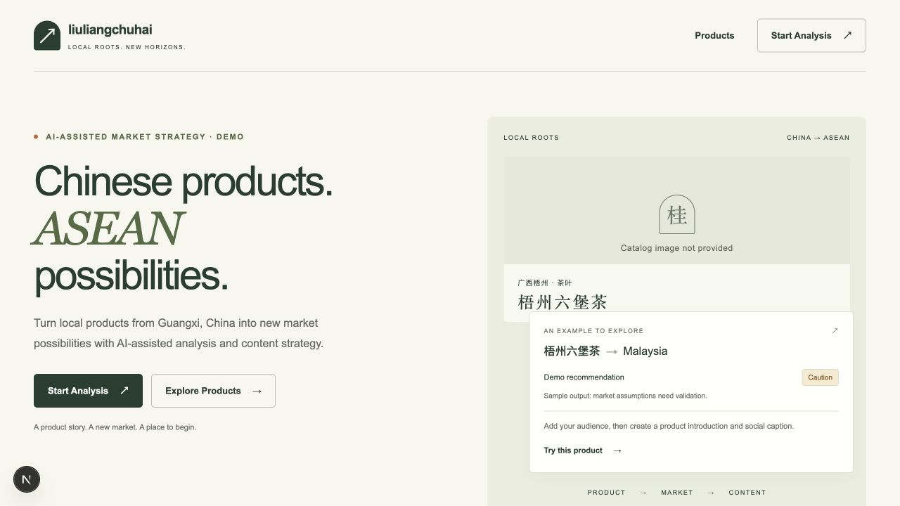
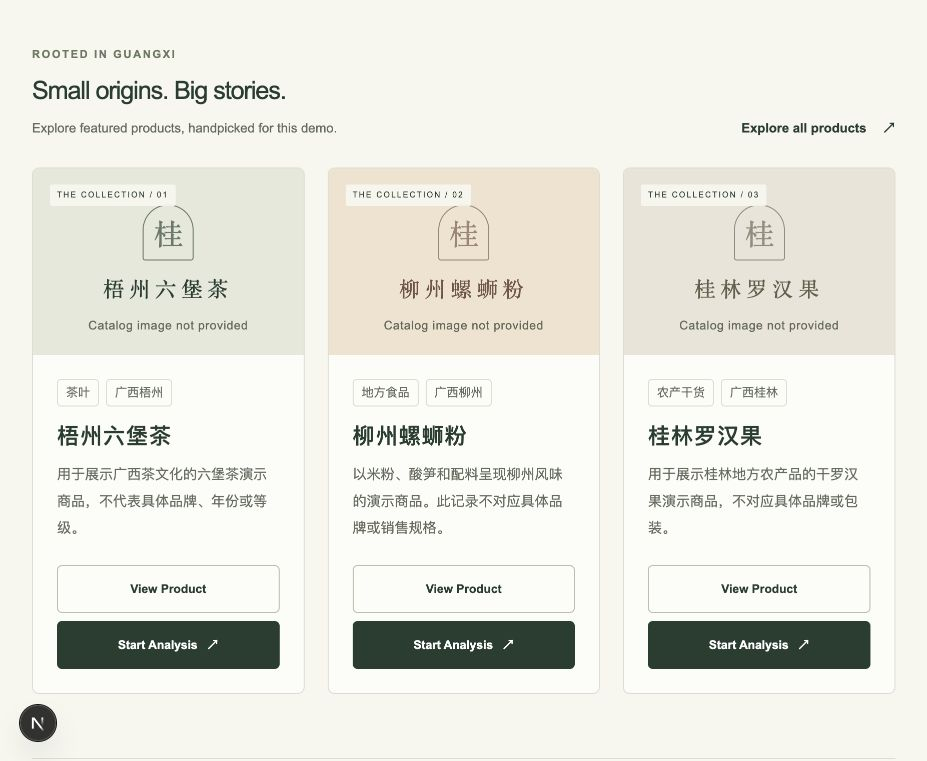
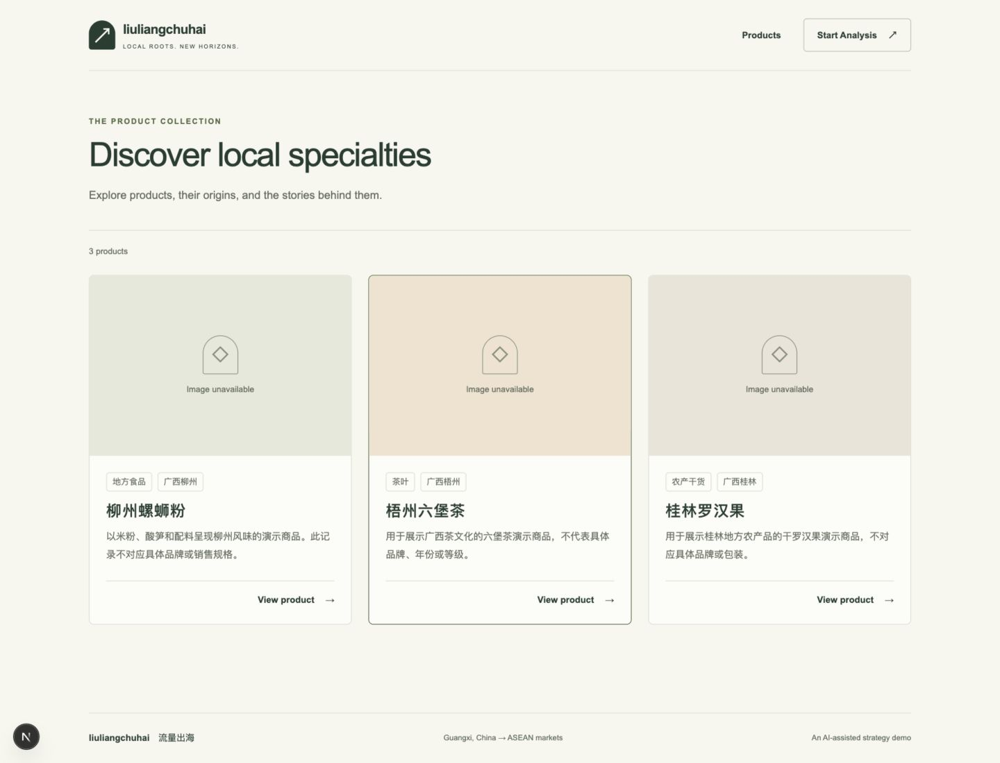
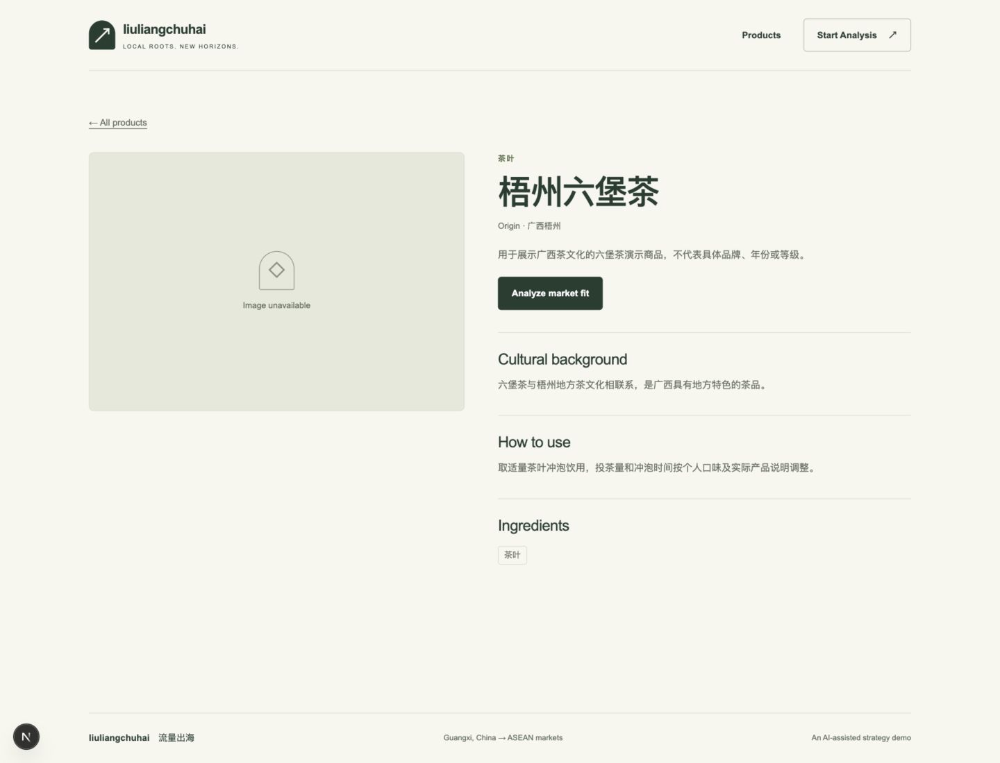
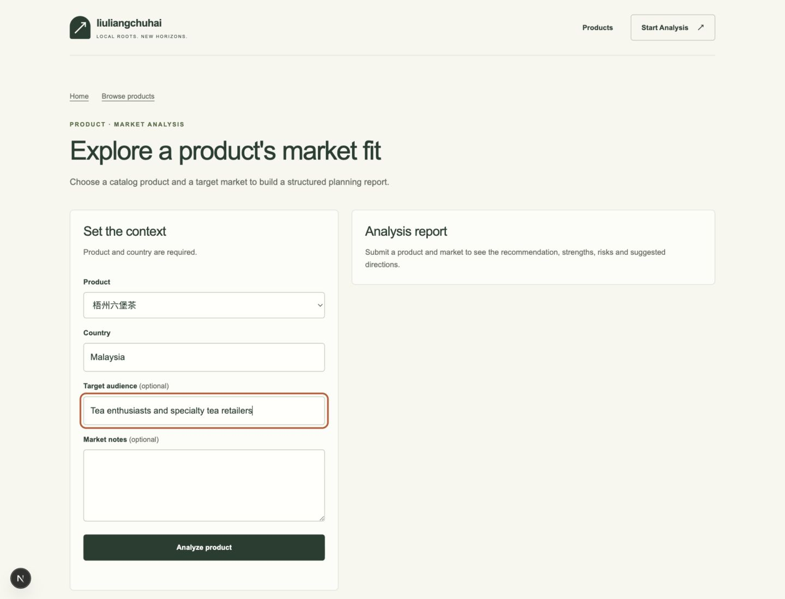
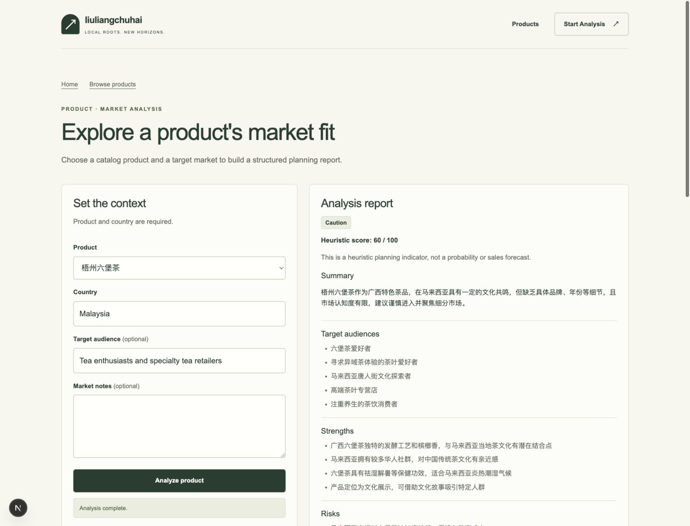
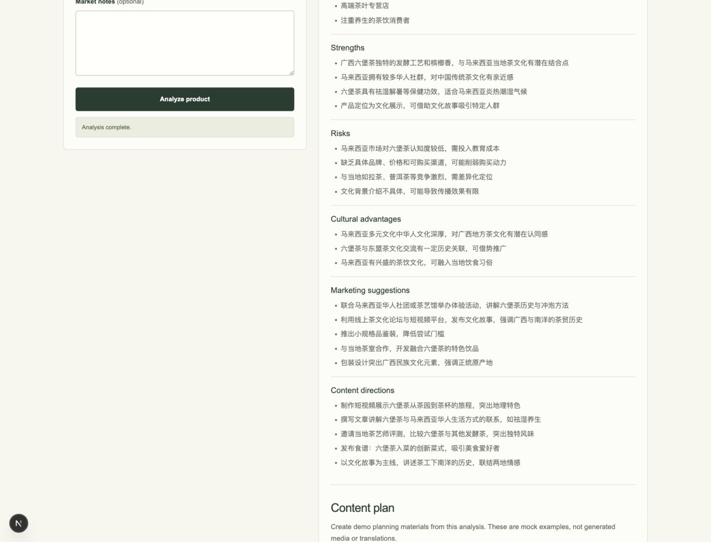
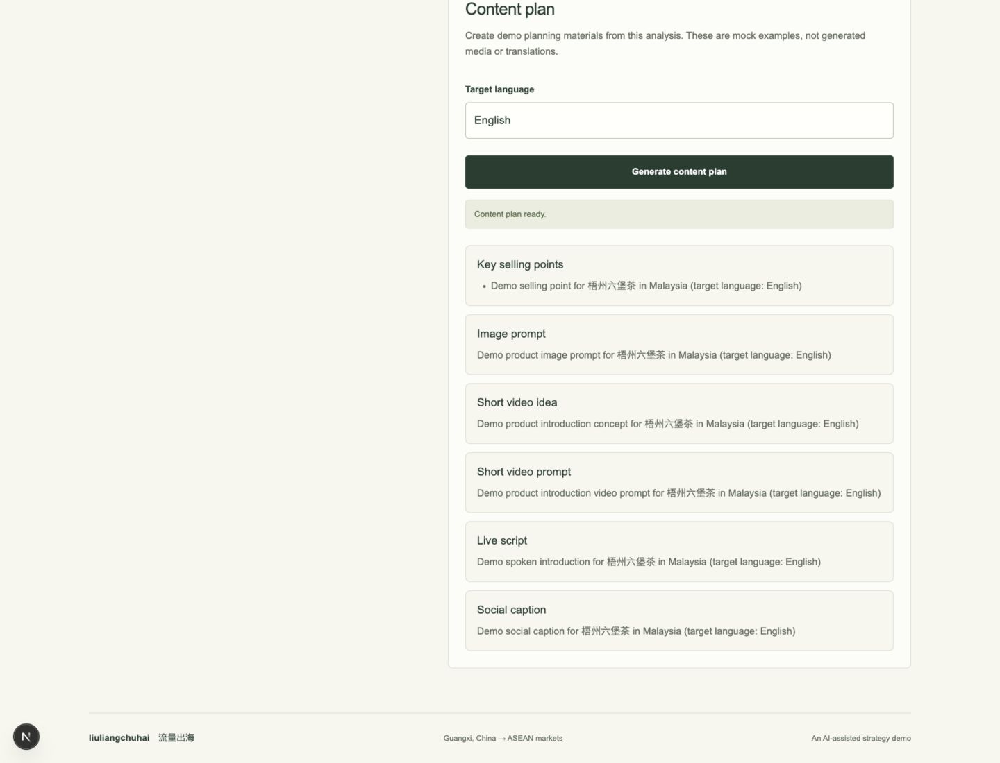

# liuliangchuhai · 流量出海

An AI-assisted market strategy demo for local products from Guangxi, China,
exploring ASEAN markets. Browse three demo products—Liuzhou luosifen, Wuzhou
Liubao tea, and Guilin monk fruit—then turn a market-fit analysis into a content
plan. Built with FastAPI and Next.js.

The default demo runs without API keys. DeepSeek can provide real market analysis
and localized content plans. Content plans are marketing copy and creative prompts,
not generated images or videos. The key-free mode keeps deterministic, explicitly
labeled mock examples.
Scores and AI claims are planning suggestions that need independent validation.

## Quick start

Prerequisites: Python 3.12+, uv, Node.js 22, and pnpm 10.33.0. Run from the repository root.

macOS/Linux:

```sh
make bootstrap
make dev
```

Windows or without Make:

```sh
uv run python scripts/dev.py bootstrap
uv run python scripts/dev.py dev
```

Bootstrap installs locked dependencies and creates `apps/api/.env` and
`apps/web/.env.local` from their examples only if they do not already exist.
The default LLM provider is `mock`; an existing local configuration is preserved.

Open [the demo](http://localhost:3000). The API runs on port 8000:
[API docs](http://localhost:8000/docs) · [provider health](http://localhost:8000/health).
Stop both development servers with Ctrl+C.

## Running with DeepSeek

After bootstrap, edit your local `apps/api/.env`:

```dotenv
LIULIANGCHUHAI_LLM_PROVIDER=deepseek
LIULIANGCHUHAI_DEEPSEEK_API_KEY=<your-key>

# Optional: these are the current defaults
LIULIANGCHUHAI_DEEPSEEK_MODEL=deepseek-v4-flash
LIULIANGCHUHAI_DEEPSEEK_TIMEOUT_SECONDS=20
```

Use your own DeepSeek API key, then restart `make dev` (or the Python equivalent).
Check `/health`: `providers.llm.provider` should be `deepseek` and `available`
should be `true`. This selector enables DeepSeek for both market analysis and Content
Plan, using the same key, model and timeout. Follow the demo flow to run both; health
alone only checks provider availability. Content Plan uses the canonical product,
market/language and the existing analysis's audience, risks and recommendation in one
bounded request, without rerunning analysis or falling back to mock on failure.

Its instructions coordinate the six fields around a localized strategy. Invalid JSON,
placeholders, too-short sections and basic English language-check failures use the existing
content-plan error. These checks do not prove factual accuracy or marketing effectiveness;
review the assets before use. If a request times out, increase the local timeout and restart.

Switch `LIULIANGCHUHAI_LLM_PROVIDER` back to `mock` and restart for the key-free demo.
Ordinary development and `make check` need no external credentials. Never commit
`.env` files or API keys; keep the key in backend configuration only.

The product assistant has an independent selector: set
`LIULIANGCHUHAI_ASSISTANT_PROVIDER=deepseek` in the same backend `.env` to enable
natural replies at `POST /assistant/chat`. It reuses the DeepSeek key, model, and
timeout above; either DeepSeek capability requires the key. The assistant defaults
to `mock`, independently of market analysis. Each reply uses one bounded provider
request, with no retries or silent mock fallback. Product context remains canonical
and optional; requests contain only the current message and optional `product_id`.

## Demo flow

1. Open `/` and choose **Explore Products**.
2. On `/products`, open a product such as **梧州六堡茶**.
3. On `/products/wuzhou-liubao-tea`, choose **Analyze market fit**.
4. On `/analysis`, confirm the preselected product, enter **Malaysia**, optionally
   add an audience or market notes, and choose **Analyze product**.
5. Read the recommendation, heuristic score, summary, audiences, strengths,
   risks, cultural advantages, marketing suggestions, and content directions.
6. Scroll to **Content plan**, enter a target language, and choose
   **Generate content plan**. The result includes selling points, an image prompt,
   a short video idea and prompt, a live script, and a social caption.

Content planning is part of `/analysis`; there is no separate `/content-plan`
page. Opening `/analysis` directly starts with an empty product selector.

## Screenshots

Captured from the running local demo. The catalog currently has no product photos
or purchase links, so its image placeholders and analysis actions are shown as-is.
The landing-page example is sample output; the DeepSeek report below is a real run.

### Landing page and featured products




### Product catalog



### Product detail



### Analysis input



### Real DeepSeek analysis

This local run used DeepSeek for Wuzhou Liubao tea in Malaysia and returned
**Caution · 60/100**. The local health endpoint reported `deepseek` available;
the analysis request completed successfully. Output varies between runs.




### Content plan result

This earlier screenshot shows the key-free mock content planner. With DeepSeek
selected, the same six sections now contain localized marketing assets.



## Development checks

Run `make check`, or `uv run python scripts/dev.py check` without Make.
See [contributing](CONTRIBUTING.md), [architecture](docs/ARCHITECTURE.md), and
[repository guidance](AGENTS.md) for development details.
